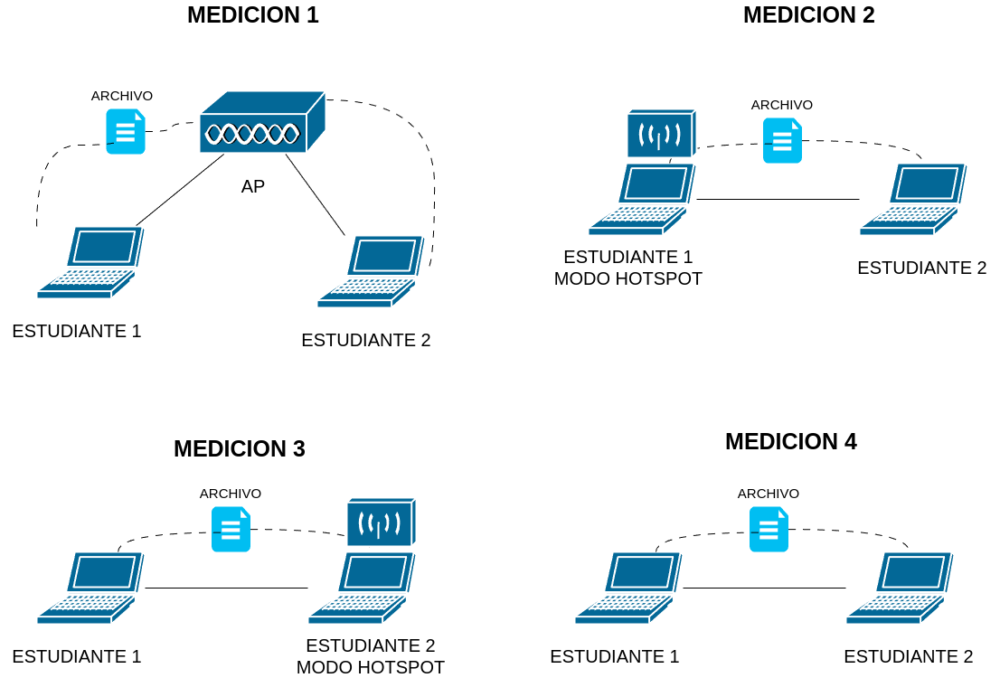

# 🛠️ Práctica 03: Transferencia de Archivos en Diferentes Medios

## 🧰 Requerimientos

- Dos computadoras con **Linux** instalado o en versión **live**. *(Trabajo en parejas)*
- Una interfaz de red **Ethernet física** o adaptador, si es necesario.
- **SSH** y **rsync** instalados en ambas computadoras.
- Un **cable de red**.

---

## 📋 Instrucciones

1. **Preparación del archivo:**
   - Cada estudiante debe crear o descargar un archivo de al menos **512 MB** que incluya su número de carné en el nombre.
   - Opción 1:  
     ```bash
     fallocate -l 512M 202112345.file
     ```
   - Opción 2: Descargar desde [vodafone](http://xcal1.vodafone.co.uk/)

2. **Transferencia 1: Usando red Wi-Fi (AP del salón)**
   - Ambos miembros deben conectarse al **AP del salón**.
   - Transferir el archivo utilizando el siguiente comando:
     ```bash
     rsync -avh --progress archivo_pesado user@host:~/carpeta
     ```

3. **Transferencia 2: Hotspot**
   - Un estudiante crea un **hotspot** desde su equipo.
   - El otro miembro se conecta a él.
   - Se realiza la transferencia del archivo usando `rsync`.
   - Luego, se **invierten los roles** y se repite el proceso.

4. **Transferencia 3: Conexión por cable**
   - Conectar ambas computadoras mediante **cable de red**.
   - Configurar **direcciones IP manualmente**.
   - Transferir el archivo usando `rsync`.

---

## 📝 Entregable

Cada estudiante entregará un **documento PDF individual** con:

- 📷 Capturas de pantalla o fotos de:
  - Creación o descarga del archivo.
  - Configuraciones de red en cada método (Wi-Fi, hotspot, cable).
  - Conexiones de red (`ip a`).
  - Información del archivo (`ls -lh archivo_pesado` o `stat archivo_pesado`).
  - Salida del comando `rsync --progress`.
  - Comprobación del archivo recibido.

- 📊 Tabla comparativa con:
  - Tiempos de transferencia.
  - Observaciones técnicas.

- ❓ Respuestas a las siguientes preguntas:
  - ¿Cuál fue la conexión más rápida y por qué?
  - ¿Cómo afectó la interferencia en la transferencia realizada inalámbricamente?
  - ¿Hubo diferencia entre transferir como cliente o servidor en el hotspot?
  - ¿Cómo afecta la latencia en cada caso?
  - Conclusión basada en los resultados obtenidos.
---

## 📐 Diagramas de medición


---

<div align="center">
<sub>2025 - CUNOC - Redes de Computadoras 1</sub>
</div>
