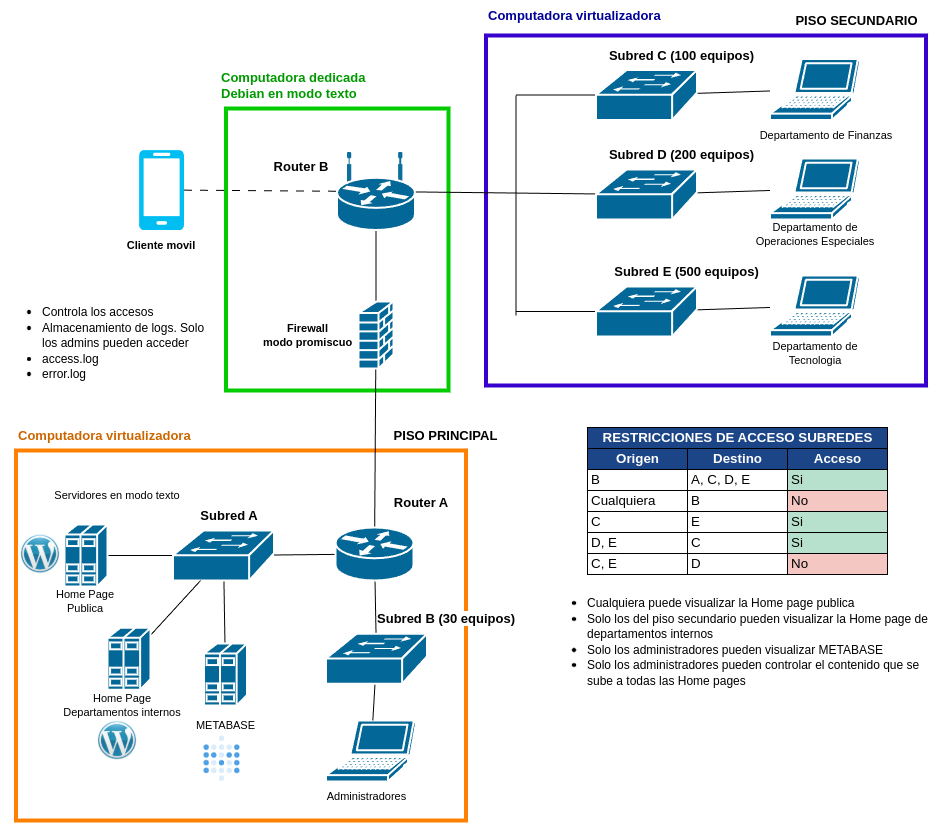

# 🚀 Proyecto Final - Redes de Computadoras 1

  

---

## 📄 Instrucciones Generales

Los detalles completos del proyecto se encuentran en los siguientes documentos adjuntos:

- [Enunciado](./assets/proyecto_final_redes1.pdf)
- [Hoja de calificacion](./assets/HC_proyecto_final_redes1.pdf)

---

## ❓ Preguntas y Respuestas

Este espacio está destinado a responder preguntas frecuentes de los estudiantes. Se irá actualizando conforme surjan nuevas dudas.

**0. ¿Hay prórroga?**  
De momento no. Sigan trabajando y de ser necesario se habla con el ingeniero.

**1. ¿Cuánto vale el proyecto?**  
Seria de consultarlo con el ingeniero. De momento solo podria decirles que como minimo la mitad del laboratorio

**2. ¿Se puede usar DHCP para asignación de IPs?**  
No, de utilizarlo serán penalizados

**3. ¿Que es lo que hace el cliente movil?**  
El cliente móvil se conecta mediante WIFI al router B para tener acceso únicamente a la `homepage pública`

**4. ¿Cada subred debería ser una máquina virtual?**  
No, la subred es diferente del cliente como tal. Para poder tener varias subredes es necesario crear switches virtuales y conectar las maquinas virtuales a estos switches.

**5. ¿Se pueden probar partes del proyecto de forma individual?**  
Podrian implementar parte de la arquitectura en las maquinas virtualizadoras y probar la comunicacion entre subredes con un router virtual (en el caso del piso secundario, se puede crear el router virtual sin embargo no forma parte de lo que se solicita en el proyecto por lo que tendran que borrarlo despues).

En el caso del router B solo se podria probar la conexion del cliente movil. Lo demás sólo podría probarse cuando estén las 3 computadoras conectadas.

**6. ¿A qué se refiere con que "Solo los administradores pueden controlar el contenido que se sube a todas las Home Pages"?**  
Básicamente con realizar la correcta instalacion de wordpress y bloquear accesos mediante SSH a cualquiera que no pertenezca a la subred de administradores.

**7. ¿Cómo se deben conectar las computadoras virtualizadoras con el Router B?**  
La computadora que tomará el rol del Router B debe tener `2 interfaces físicas de red`, entonces la conexión debe hacerse con un cable de Ethernet utilizando las interfaces físicas de cada computadora.

---

## ✏️ Notas
Este archivo se actualizará con respuestas adicionales y/o nuevas versiones del documento si es necesario.  
Última actualización: 11 de Abril 2025

2025 - CUNOC - Redes de Computadoras 1

